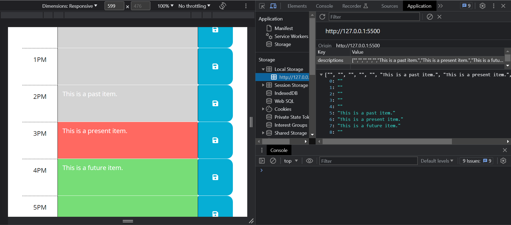

# Work-Day-Scheduler

## Description

This is a day scheduler that allows a user to schedule their day and save it.
The data gets stored in the browsers local storage so that it does not disappear after page refresh/reload.
Dynamic logic also allows for the schedule to highlight which time block(s) are in the past, present, and future respectively.

## Usage

## URL

[Link to live website.](https://bhansi.github.io/Work-Day-Scheduler/)
